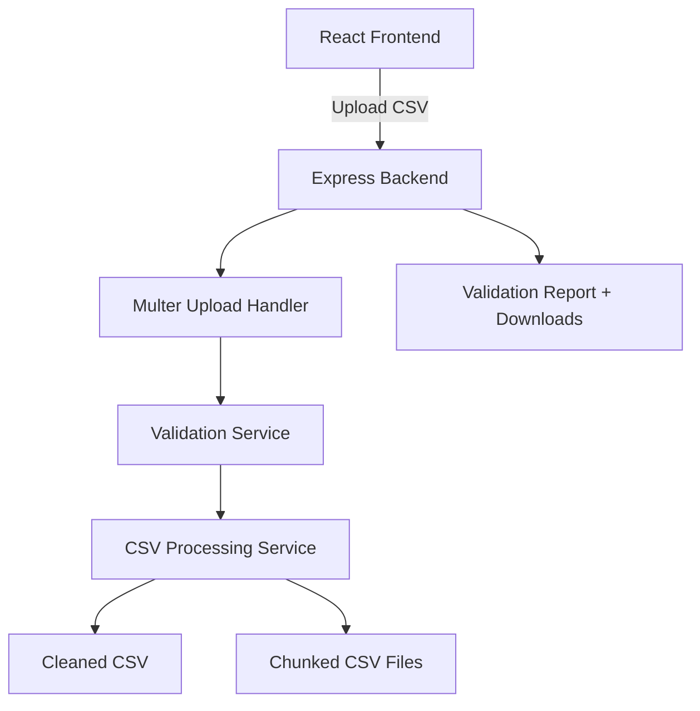

# FinVerify – AI-Powered Transaction Data Validation Platform

FinVerify is a full-stack web application that validates, cleans, and processes transaction datasets before they are imported into business or financial systems.

The platform accepts CSV files containing order details, product information, and payment data, performs comprehensive validation checks, generates detailed error reports, and exports clean datasets in downloadable CSV formats.

---

## Features

### Data Validation

* Email validation
* Transaction amount validation
* Date format validation
* Country-specific phone number validation
* Payment mode validation
* Duplicate transaction detection

### Data Processing

* CSV upload and parsing
* Automatic data cleaning
* Row-level error reporting
* Chunked file generation
* Downloadable processed files

### User Interface

* Drag-and-drop file upload
* Upload progress tracking
* Validation summary dashboard
* Searchable error reports
* Processed file downloads

---

## Tech Stack

### Frontend

* React.js
* Vite
* Axios
* CSS3

### Backend

* Node.js
* Express.js
* Multer
* csv-parser
* json2csv
* Day.js

---

## System Architecture



---

## Project Structure

```text
FinVerify/
│
├── backend/
│   ├── controllers/
│   ├── routes/
│   ├── services/
│   ├── utils/
│   ├── uploads/
│   ├── processed/
│   ├── server.js
│   └── package.json
│
├── frontend/
│   ├── src/
│   │   ├── components/
│   │   ├── utils/
│   │   ├── App.jsx
│   │   └── main.jsx
│   ├── vite.config.js
│   └── package.json
│
└── README.md
```

---

## Validation Rules

### Email

Validates standard email format.

### Amount

* Must be numeric
* Must be greater than zero

### Date

Supported formats:

* YYYY-MM-DD
* DD-MM-YYYY
* DD/MM/YYYY
* MM/DD/YYYY

### Phone Numbers

#### India

* Supports +91, 91, or local format
* Must contain exactly 10 digits

#### Singapore

* Supports +65, 65, or local format
* Must contain exactly 8 digits

### Payment Modes

Supported values:

* Credit Card
* Debit Card
* Net Banking
* UPI
* Wallet

---

## API Endpoints

### Upload & Process CSV

```http
POST /api/transactions/upload
```

#### Request

```multipart/form-data
file: transactions.csv
chunkLimit: 1000
```

#### Response

```json
{
  "success": true,
  "message": "File processed successfully",
  "data": {
    "summary": {
      "totalRows": 1500,
      "validRows": 1450,
      "invalidRows": 50
    }
  }
}
```

---

### Download Processed File

```http
GET /api/transactions/download/:sessionId/:filename
```

Downloads generated CSV files.

---

## Local Setup

### Clone Repository

```bash
git clone https://github.com/Vivekraj2324/FinVerify.git
cd FinVerify
```

### Backend Setup

```bash
cd backend
npm install
npm run dev
```

Backend runs on:

```text
http://localhost:5000
```

### Frontend Setup

```bash
cd frontend
npm install
npm run dev
```

Frontend runs on:

```text
http://localhost:5173
```

---

## Deployment

### Backend

Deploy on Render:

```text
Root Directory: backend
Build Command: npm install
Start Command: npm start
```

### Frontend

Deploy on Vercel:

```text
Build Command: npm run build
Output Directory: dist
```

Environment Variable:

```env
VITE_API_URL=https://your-backend-url/api
```

---

## Future Enhancements

* AI-based anomaly detection
* Dashboard analytics and charts
* User authentication
* Cloud storage integration
* Processing queues using Redis/BullMQ
* Multi-country validation support
* Audit logs and processing history

---

## Author

**Vivek Raj**

Full Stack Developer | React.js | Node.js | Express.js

---

## License

This project is licensed under the [MIT License](LICENSE).
