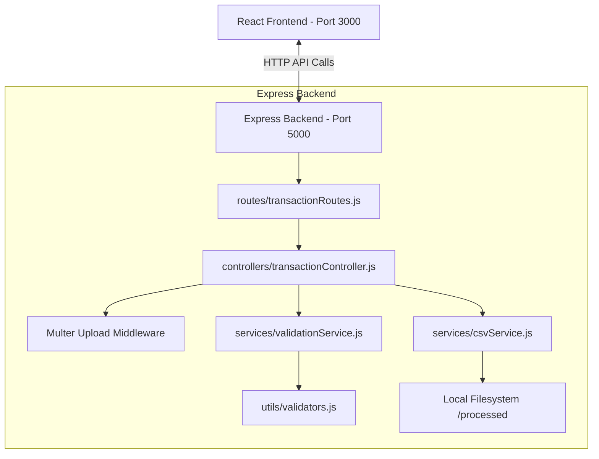

# Transaction Data Validator & Processor

Welcome to the **Transaction Data Validator & Processor** application. This project is a production-ready, full-stack transaction validation and segmenting system built using **React.js** on the frontend and **Node.js + Express.js** on the backend. 

This document serves as your complete guide, architectural reference, and interview preparation vault. Read this carefully to prepare for your internship interview defenses.

---

## 1. System Architecture & Diagrams

### A. Architectural Overview Diagram
The system follows a decoupling design using a **Client-Server Architecture** with layered backend responsibilities:



### B. Folder Structure Diagram
The codebase is structured logically to maintain a clean separation of concerns:

```
/project/
├── backend/
│   ├── package.json              # Backend configuration & dependencies
│   ├── server.js                 # Express server bootstrap & error handler
│   ├── routes/
│   │   └── transactionRoutes.js  # Path mapping endpoints
│   ├── controllers/
│   │   └── transactionController.js # Request coordinates & upload middleware
│   ├── services/
│   │   ├── validationService.js  # CSV reading, validation logic, stats generator
│   │   └── csvService.js         # Writing cleaned CSVs and chunk segments
│   └── utils/
│       └── validators.js         # Pure validation functions (Email, Phone, Date)
├── frontend/
│   ├── package.json              # Frontend config & dependencies
│   ├── vite.config.js            # Build setup & backend dev proxy
│   ├── index.html                # Root HTML page
│   └── src/
│       ├── main.jsx              # React mounting script
│       ├── App.jsx               # Dashboard container & state coordinator
│       ├── App.css               # Obsidian Glassmorphic style sheet
│       ├── utils/
│       │   └── api.js            # Pre-configured Axios service instance
│       └── components/
│           ├── FileUpload.jsx    # File pickup & chunk size configurations
│           ├── ValidationSummary.jsx # Visual stats metrics cards
│           ├── ErrorReport.jsx   # Error filter logs table
│           └── DownloadSection.jsx # Download buttons for outputs
└── README.md                     # Comprehensive Guide & Interview Vault
```

### C. Data Flow Diagram
This shows the lifecycle of the transaction data, from the user's raw CSV upload to the download of segmented chunks:

```mermaid
sequenceDiagram
    autonumber
    actor User as Client Browser
    participant API as Express Server
    participant Val as Validation Service
    participant CSV as CSV Output Service
    
    User->>API: POST /api/transactions/upload (CSV File + Chunk Limit)
    Note over API: Multer captures & saves<br/>temp CSV file inside /uploads
    API->>Val: validateCSV(tempFilePath)
    Note over Val: Streams file line-by-line;<br/>normalizes column headers;<br/>checks fields via validators.js
    Val-->>API: Returns validation report JSON & valid JSON rows array
    API->>CSV: processCSVOutput(validRows, chunkLimit, sessionId)
    Note over CSV: Converts JSON to CSV;<br/>Saves cleaned.csv;<br/>Splits into chunk_x.csv segments
    CSV-->>API: Returns output filenames
    Note over API: Deletes temporary upload file<br/>from /uploads to prevent bloat
    API-->>User: Returns 200 OK + Report JSON & download links
    User->>API: GET /api/transactions/download/:sessionId/:filename
    API-->>User: Streams requested CSV file as download attachment
```

### D. API Flow Diagram
This outlines how endpoints map to files and what error handler checks protect each path:

```mermaid
graph TD
    Request[Incoming API HTTP Request] --> Match{Endpoint Path?}
    
    Match -->|POST /api/transactions/upload| UploadHandler[Multer parses file & saves to /uploads]
    UploadHandler --> ValEngine[validationService.js parses & filters records]
    ValEngine --> Writer[csvService.js writes cleaned/chunks files]
    Writer --> ResponseSuccess[200 OK: Send stats summary, errors array & downloadInfo]
    
    Match -->|GET /api/transactions/download/:sessionId/:filename| DownloadHandler[csvService.js checks file availability]
    DownloadHandler -->|File Found| StreamDownload[res.download() starts browser save dialog]
    DownloadHandler -->|Not Found| Response404[404 Error: File not found]
    
    ErrorCatch[Any code crash / file limit exceeded] --> GlobalErrorHandler[server.js: Global Error Middleware]
    GlobalErrorHandler --> ResponseError[Format JSON message & status code: 400 or 500]
```

---

## 2. API Design Specification

### Endpoint 1: Upload and Process CSV
* **Method**: `POST`
* **Path**: `/api/transactions/upload`
* **Content-Type**: `multipart/form-data`
* **Request Body**:
  * `file`: (Binary) The transaction CSV file.
  * `chunkLimit`: (Number, Optional) Maximum row size per segment file (Default: `1000`).
* **Success Response (200 OK)**:
```json
{
  "success": true,
  "message": "File processed successfully",
  "data": {
    "summary": {
      "totalRows": 1500,
      "validRows": 1450,
      "invalidRows": 50,
      "errorCount": 54
    },
    "errors": [
      {
        "row": 12,
        "data": {
          "Transaction ID": "TX0012",
          "Amount": "-150",
          "Date": "2026/13/45",
          "Email": "invalid-email",
          "Phone": "98765",
          "Country": "India",
          "Payment Mode": "Cash"
        },
        "errors": [
          "Invalid amount '-150': Must be a positive number",
          "Invalid date '2026/13/45': Format must be YYYY-MM-DD or standard ISO",
          "Invalid email format 'invalid-email'",
          "Invalid phone '98765' for India: Must be 10 digits (excluding +91/91)",
          "Invalid payment mode 'Cash': Must be Credit Card, Debit Card, Net Banking, UPI, or Wallet"
        ]
      }
    ],
    "downloadInfo": {
      "sessionId": "1718542910-1284792",
      "cleanedFile": "cleaned.csv",
      "chunks": ["chunk_1.csv", "chunk_2.csv"]
    }
  }
}
```

---

### Endpoint 2: Download Processed File
* **Method**: `GET`
* **Path**: `/api/transactions/download/:sessionId/:filename`
* **Response**: Binary stream download containing the target CSV.
* **Error Response (404 Not Found)**:
```json
{
  "success": false,
  "message": "Requested file not found or expired"
}
```

---

## 3. Dynamic Validation Logic Details
The validation engine performs granular inspection of fields in [validators.js](file:///Users/vivekraj/Documents/project/backend/utils/validators.js):

1. **Email Address**: Regular Expression (`/^[a-zA-Z0-9._%+-]+@[a-zA-Z0-9.-]+\.[a-zA-Z]{2,}$/`) evaluated against standard address syntax.
2. **Amount**: Parsed into a float number, validating that it is not `NaN` and is strictly positive (`> 0`).
3. **Date**: Checked in strict mode against standard date format configurations using `dayjs` (including format patterns: `YYYY-MM-DD`, `DD-MM-YYYY`, `DD/MM/YYYY`, `MM/DD/YYYY`).
4. **Geographic Phone Rules**:
   * **Country**: Must be `India` or `Singapore` (case-insensitive). Other countries trigger unsupported errors.
   * **India Phone**: Strips country codes (`+91`, `91`, or `0` prefix), verifying that the trailing number is precisely **10 digits**.
   * **Singapore Phone**: Strips country codes (`+65` or `65`), verifying that the trailing number is precisely **8 digits**.
5. **Payment Mode**: Checks if the string equals `Credit Card`, `Debit Card`, `Net Banking`, `UPI`, or `Wallet` (case-insensitively).

---

## 4. Step-by-Step Deployment Instructions

### A. Backend Deployment: Render (https://render.com)
Render is an excellent cloud host for Express backend environments.

1. **Sign In**: Log into Render and click **New** -> **Web Service**.
2. **Connect Repo**: Link your GitHub repository.
3. **Set Settings**:
   * **Name**: `transaction-validator-api`
   * **Root Directory**: `backend` (Crucial! Tells Render to focus execution only in the backend folder).
   * **Environment**: `Node`
   * **Build Command**: `npm install`
   * **Start Command**: `npm start`
4. **Environment Variables**: Add inside **Environment** panel:
   * `NODE_ENV` = `production`
   * `PORT` = `10000` (Render binds automatically, but declaring a port ensures runtime safety).
5. **Deploy**: Click **Create Web Service**. Write down the service URL provided (e.g. `https://transaction-validator-api.onrender.com`).

---

### B. Frontend Deployment: Vercel (https://vercel.com)
Vercel is optimized for React/Vite builds.

1. **Install Vercel CLI** (or connect repository in Vercel UI):
   ```bash
   npm install -g vercel
   ```
2. **Run Vercel Deploy Command**:
   Open terminal inside the `frontend` folder and run:
   ```bash
   vercel
   ```
3. **Answer Prompts**:
   * Link to existing project? **No**
   * Project Name? `transaction-validator-ui`
   * In which directory is your code located? `./`
   * Want to override build configuration? **Yes** -> Set Build Command to `npm run build` and Output Directory to `dist`.
4. **Add Environment Variable**:
   Configure the production backend URL so that Vite communicates with the Render API, bypassing the local dev proxy:
   * Key: `VITE_API_URL`
   * Value: `https://transaction-validator-api.onrender.com/api` (Use the Render service URL created above, with `/api` appended).
5. **Push to Production**:
   ```bash
   vercel --prod
   ```

---

## 5. Interview Preparation Vault

### Component Analysis & Tradeoffs

#### 1. Core Framework: Express.js
* **What I built**: An Express server exposing routes for CSV validation and downloads.
* **Why I built it**: Express has an enormous ecosystem, is extremely lightweight, and handles raw request streams elegantly.
* **Alternatives**: NestJS or Fastify.
* **Tradeoffs**: NestJS offers TypeScript-first organization but introduces heavy overhead and architectural boilerplates that are unnecessary for a light API. Fastify is faster, but has slightly smaller community documentation for middlewares like Multer.

#### 2. Streaming CSV Parser: `csv-parser`
* **What I built**: A validation service reading the files stream-by-stream using `fs.createReadStream().pipe(csvParser())`.
* **Why I built it**: Loading large files directly into RAM can trigger memory crashes (V8 Out-Of-Memory errors). Streaming reads chunks sequentially, maintaining a tiny memory footprint.
* **Alternatives**: Papa Parse or fs.readFileSync.
* **Tradeoffs**: Using `fs.readFileSync` is easier to write, but it loads the entire file into buffer RAM. Streaming handles files up to gigabytes without increasing the server's memory footprint.

#### 3. Client API Client: Axios
* **What I built**: A central Axios service module (`api.js`) to handle file uploads.
* **Why I built it**: Axios handles HTTP request abstractions cleanly, throwing on error statuses automatically, and provides easy access to request progress events (`onUploadProgress`).
* **Alternatives**: Native `fetch()`.
* **Tradeoffs**: Native `fetch` is built into the browser, saving bundle size, but requires writing manual progress trackers and double-parsing responses (`await res.json()`), which increases boilerplates.

#### 4. Styling System: Dark Glassmorphic CSS
* **What I built**: A dark HSL glassmorphism system using standard vanilla CSS custom variables and backdrop blur filters.
* **Why I built it**: A tailored vanilla CSS file allows maximum design control, clean micro-animations, and avoids dragging down React bundle performance.
* **Alternatives**: Tailwind CSS or CSS-in-JS (Styled Components).
* **Tradeoffs**: Tailwind CSS allows rapid creation, but makes HTML markup cluttered. Vanilla CSS keeps styling organized separately and is easier to showcase in standard interviews as it demonstrates core CSS competencies.

---

### 30 Likely Interviewer Questions & Answers

#### Q1. Why did you choose Express over other frameworks?
Express is lightweight, highly configurable, and has a massive community ecosystem. It integrates seamlessly with standard middleware packages like Multer and allows us to get a robust service running with minimal boilerplate.

#### Q2. What problem does Multer solve?
By default, Node.js servers cannot easily read multipart/form-data request streams (which carry file uploads). Multer intercepts these multi-part requests, isolates binary data, saves the file to a designated uploads directory, and attaches files metadata directly onto the request object as `req.file`.

#### Q3. How does the CSV parsing work, and why did you use streams?
We used Node's `fs.createReadStream()` piped into `csv-parser`. This design reads file data in small chunks sequentially. If we uploaded a 1GB file containing 10 million rows, standard functions like `fs.readFile()` would load the entire 1GB into the server's RAM, potentially crashing it. Streaming processes each row one-by-one, keeping server memory usage constant at a few megabytes.

#### Q4. How do you handle file upload security vulnerabilities?
We configured a file filter in Multer that matches both file extensions (.csv) and MIME types (`text/csv` / `application/vnd.ms-excel`). This stops users from uploading executable `.sh` or `.exe` files. We also set a strict file size limit of 5MB.

#### Q5. How does your backend handle concurrent uploads from different users?
In `csvService.js`, when a file is processed, we generate a unique `sessionId` (using timestamps and random hashes) and create a directory named `processed/<sessionId>/` for the output files. This ensures that concurrent users never overwrite each other's cleaned files or chunks.

#### Q6. What is the difference between validation error log rows starting at Index 2 instead of 1 or 0?
In spreadsheets, row 1 is always the header label row, and data starts on row 2. Presenting failures with row numbers matching their exact spreadsheet row indexes (Row 2, Row 3...) makes it extremely easy for a business user to fix the data in Excel or Google Sheets.

#### Q7. Why did you choose Day.js over Moment.js?
Moment.js is a legacy library that is no longer actively developed. It has a massive bundle size (around 70KB) and features mutable objects, which can introduce bugs. Day.js is a modern, lightweight (2KB) alternative with an identical API that uses immutable objects.

#### Q8. What would happen if a user uploads a CSV with missing headers or mixed columns?
In `validationService.js`, we normalized keys by stripping spaces, underscores, and converting to lowercase. If required fields like `amount` or `email` are still missing after normalization, our code catches this and flags an error detailing the missing columns, skipping subsequent field validations.

#### Q9. Why did you implement a Vite dev server proxy instead of hardcoding API paths?
Using a proxy prevents hardcoding local development ports (like `http://localhost:5000`) inside components. It also prevents CORS issues in local development and makes deploying simple: in production, requests are sent to `/api` relative to the server host, while in development, Vite proxies them.

#### Q10. How would you scale this application to process 1 million transaction rows?
1. **Frontend**: Avoid rendering 1 million rows directly in the browser DOM. Implement virtual scrolling (rendering only visible rows) or paginate the error table.
2. **Backend**: Keep the entire validation process stream-based. Instead of gathering all valid records into a massive RAM array to chunk them, we should write rows to chunk files *directly* inside the stream's `.on('data')` event using stream-writers.
3. **Database**: Save validation reports in a database rather than returning a massive JSON payload directly in the HTTP response.

#### Q11. What are the limitations of your current local file system storage?
Using local server storage (`/processed/`) works well on a single server, but will fail in cloud environments like Heroku or Render. These platforms use ephemeral filesystems (files are deleted when the server restarts) and fail to share files across scaled, multi-server environments.

#### Q12. How would you resolve this ephemeral filesystem limitation in a production scale-up?
We would upload the processed and chunked CSV files to a cloud object store like **Amazon S3** or **Google Cloud Storage**. Instead of streaming files from our server, we would generate a secure, temporary **presigned URL** from S3 and return that URL to the client for direct downloading.

#### Q13. How did you structure your backend to follow clean architecture principles?
We split the code into:
- **Routes**: Handle endpoint definitions.
- **Controllers**: Handle HTTP request validation, request parsing, and response mapping.
- **Services**: Contain the core business logic (parsing, validating, writing files).
- **Utils**: Pure helper functions.
This separation makes testing easy since we can test utilities and services independently of HTTP server logic.

#### Q14. Why did you use HSL color variables instead of hex codes?
HSL (Hue, Saturation, Lightness) makes it incredibly easy to programmatically modify color weights, design cohesive palettes, adjust contrasts for accessibility, and create hover effects simply by tweaking the lightness percentage.

#### Q15. How does the upload progress bar work in the UI?
Axios' `post` method accepts a configuration object with an `onUploadProgress` callback function. This function gives us progress events with the `loaded` (bytes uploaded) and `total` (total file bytes). We calculate `(loaded * 100) / total` and bind it to our reactive progress bar width.

#### Q16. Why do we delete the uploaded CSV from `/uploads` after validation?
If we kept the uploaded files, our server disk would fill up over time, leading to disk space depletion and server crashes. Deleting the temp file in the `finally` block of the controller ensures cleanup runs even if parsing fails.

#### Q17. How do you handle duplicate transaction IDs in the uploaded CSV?
After validating individual rows, we run a deduplication pass in `validationService.js` using a JavaScript `Set`. If a Transaction ID is seen more than once within the valid collection, the duplicates are flagged and moved to the error log.

#### Q18. How would you secure the download endpoint in an enterprise environment?
1. **Authentication**: Require valid JWT headers.
2. **Access Control**: Verify that the authenticated user owns the transaction dataset.
3. **Short-lived Links**: Use signed tokens with a 15-minute expiration time.

#### Q19. Why use vanilla CSS instead of a library like Tailwind for this project?
Vanilla CSS demonstrates core stylesheet competencies (flexbox, CSS grids, animations, variable definitions). It avoids bundling overhead and keeps the component markup clean, which is highly appreciated in frontend interviews.

#### Q20. What is CORS and why is it needed here?
Cross-Origin Resource Sharing is a browser security mechanism. Since our frontend runs on port 3000 and the backend runs on port 5000, the browser blocks standard HTTP calls. CORS configuration on the server allows the frontend's origin to communicate securely.

#### Q21. Why did you use `json2csv` instead of writing custom comma-split strings?
CSV formatting has edge cases: fields containing commas, double quotes, or newlines must be properly escaped in quotes. `json2csv` handles these standard RFC 4180 rules automatically, preventing corrupted CSVs.

#### Q22. How did you handle errors to prevent the Node.js server from crashing?
We wrapped the controller code in `try-catch` blocks and piped failures to the global Express error-handler middleware (`next(error)`). This intercepts errors and returns structured JSON responses instead of crashing the process.

#### Q23. Why is backdrop-filter blur important in glassmorphism?
The `backdrop-filter: blur()` property blurs elements behind the glass container, which creates a visual layer hierarchy. It ensures text readability even when background elements are dynamic.

#### Q24. How would you write automated tests for this codebase?
We would use **Jest** and **Supertest**. We'd write unit tests for the validator functions in `utils/validators.js` and integration tests for the `/upload` API endpoint using mock CSV files to verify response payloads.

#### Q25. Why did you normalize keys in the parser?
Users might export sheets with headers like "Transaction ID", "transaction_id", or "transactionid". Normalizing keys by stripping spaces/underscores and lowercase mapping makes the validation engine resilient to minor formatting variations.

#### Q26. How do you check if a phone number is from Singapore vs India?
The uploaded row must contain a `Country` column. If the country is India, we validate using Indian phone rules (10 digits). If Singapore, we validate using Singaporean rules (8 digits). Any other country is flagged as unsupported.

#### Q27. What is the difference between developer dependencies and standard dependencies?
Standard dependencies (like `express`) are required at runtime in production. Developer dependencies (like `nodemon`) are only needed during local development and are excluded from the production build to save space.

#### Q28. What would you improve in this project if you had more time?
1. Implement **Redis queue queues** to process uploads asynchronously, allowing us to send emails or webhooks when processing completes.
2. Add **visual charts** (like bar/pie charts) using Chart.js to display the breakdown of errors by type in the dashboard.
3. Implement **JWT Authentication** to allow users to securely view their history of processed ledgers.

#### Q29. How would you handle a memory leak in Node.js?
We would use Chrome DevTools (`node --inspect`) or memory profiling tools like heapdump to capture heap snapshots during file processing. Comparing snapshots lets us identify which objects are not being garbage collected.

#### Q30. Why did you structure your backend using a controllers-services pattern?
This enforces the **Single Responsibility Principle**. Controllers handle HTTP requests and responses, while Services handle core business logic. This makes the code modular, maintainable, and easy to unit test.

---

### Walkthrough & Pitch Scripts

#### 2-Minute Interview Walkthrough Script
> "I built the Transaction Data Validator & Processor to solve a common enterprise problem: validating large financial ledgers before import.
>
> On the frontend, I designed an obsidian glassmorphic dashboard using React. It features drag-and-drop file upload, custom configurations for row split limits, a metrics dashboard, and an interactive log table with search filtering.
>
> For the backend, I used Node.js and Express. To make the validation engine scale, I used Node streams to process the CSV file chunk-by-chunk instead of loading it entirely into RAM, maintaining a constant memory footprint. The engine normalizes column headers to tolerate variations, validates emails, dates, payment modes, and applies geographic phone rules for India and Singapore.
>
> Valid records are saved as a cleaned CSV, and split into multiple files if they exceed the user's split limit. Processed files are saved in secure, session-isolated folders to handle concurrent users safely. I also configured global error handling and an API proxy, and prepared the project for deployment on Vercel and Render."

#### Resume Project Description
* **Transaction Data Validator & Processor (React, Node.js, Express, Axios, Multer)**
  * Engineered a full-stack CSV validation and processing system that handles file uploads, validates records against business rules, and outputs cleaned, split files.
  * Designed a scalable backend using Node streams and `csv-parser` to parse and validate files line-by-line, maintaining a constant memory footprint.
  * Built an interactive glassmorphic React dashboard featuring drag-and-drop file upload, real-time progress tracking via Axios, validation metrics, and error logs with search filtering.
  * Implemented session-isolated file storage for concurrent uploads, global error handling, and Vite proxy configurations.

#### 3-Line Submission Write-Up
* **Project Name**: Transaction Data Validator & Processor
* **Tech Stack**: React.js, Node.js, Express, Axios, Multer, Day.js, json2csv, csv-parser.
* **Core Achievement**: Built a full-stack, stream-based validation dashboard that parses transaction CSV files line-by-line, normalizes column headers, applies geographic phone validation, and generates cleaned, split output files.
